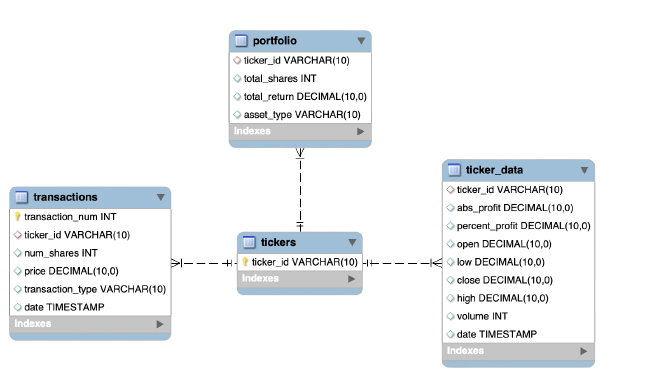
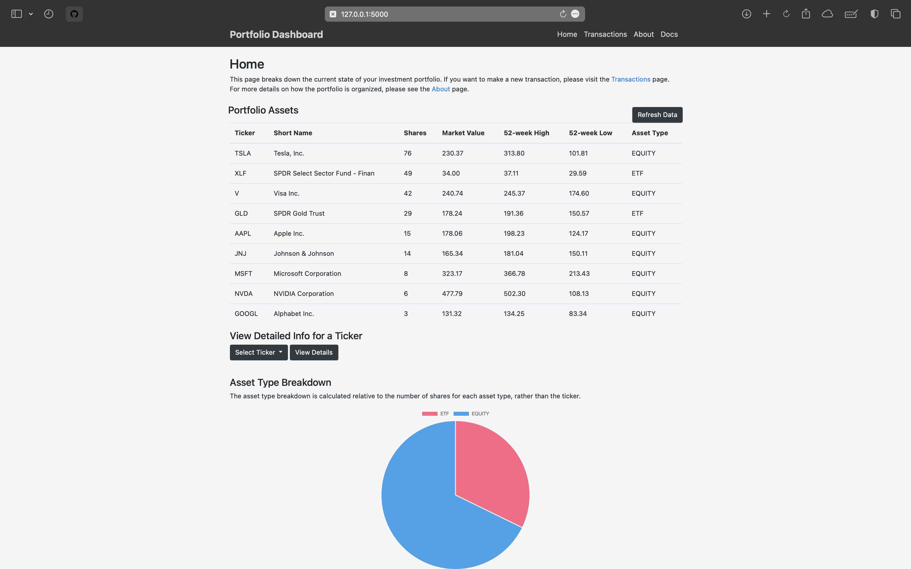
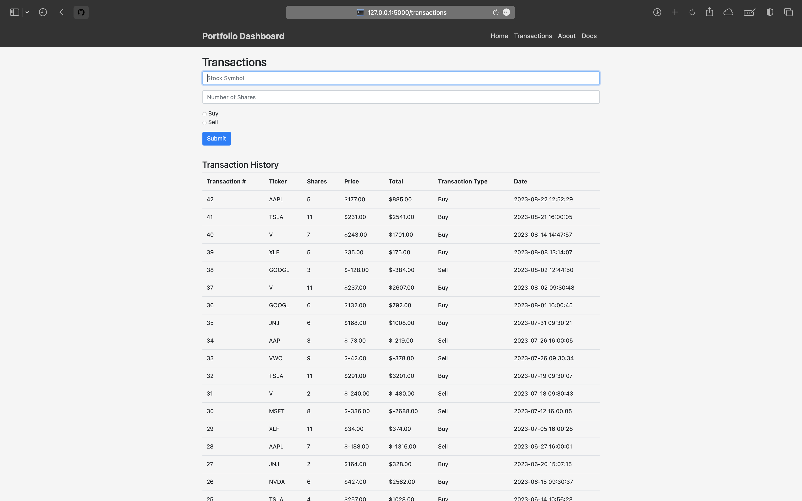

## 📝 Table of Contents

- [📝 Table of Contents](#-table-of-contents)
- [🧐 Project Description ](#-project-description-)
- [⚙️ Installation](#️-installation)
- [📊 Usage ](#-usage-)
- [⛏️ Built With ](#️-built-with-)
- [🪫 Current Limitations ](#-current-limitations-)
- [🚀 Future Scope ](#-future-scope-)
- [✍️ Authors ](#️-authors-)
- [📸 Demo Images ](#-demo-images-)
- [📃 License](#-license)

## 🧐 Project Description <a name = "description"></a>
Our team aimed to design a web application with an API that guides clients in managing a financial portfolio, allowing clients to:
- View the performance of their portfolios
- Add or remove assets from their portfolios
- View detailed info on trends over time for each asset in their portfolio
- View their transaction history
- See a breakdown of their portfolio by asset type

This tool allows clients to have an easy-to-use interface that can help them understand the current trends in the market, view the status of their own financial portfolios, and make informed decisions about their assets.

Data from the webapp can also be accessed manually through a variety of API endpoints. For more information, please refer to the `docs.html` page.

<!-- todo add db structure and a demo video(?) -->


## ⚙️ Installation
To play around with the project, you can clone this repo and run the following steps. It is recommended to use a Python virtual environment to run the project. 

Run a local `MySQL` server and initialize the database schema:


```mysql
mysql -u root -p
source schema/schema.sql
```

Install the required packages in your virtual environment shell:
```bash
pip install -r requirements.txt
```

Optionally, you can generate a random database with a valid transaction history. `generate_data.py` assumes trading began on 2023-01-01 and ended on the current day. Live transactions can be made with the `buy` and `sell` buttons on the webapp. 
```bash
cd flaskr/
python generate_data.py
```

```bash
cd flaskr/
python -m flask_app flask run
```
## 📊 Usage <a name="usage"></a>

Once the server is running, you can access the webapp at `http://localhost:5000/`. For details on how to use the webapp, please refer to the `about.html` page. If you're interested in the backend logic, please refer to the docstrings in `db_api.py` and `generate_data.py` and the `docs.html` page.

## ⛏️ Built With <a name = "tech_stack"></a>
- [MySQL](https://www.mysql.com/) - Database
- [Flask](https://flask.palletsprojects.com/en/2.3.x/) - Server
- [Yahoo Finance API](https://finance.yahoo.com/) - Financial Data Source
- [Bootstrap](https://getbootstrap.com/) - CSS Framework
- [Python](https://www.python.org/) - Backend Logic

## 🪫 Current Limitations <a name = "limitations"></a>
The current version of the webapp has the following limitations:
- Only supports one client
- Slow loading of financial information from Yahoo Finance API
- Unable to manually sort assets in the portfolio through the webapp
- Cannot see detailed information for assets that are not in the portfolio
  
## 🚀 Future Scope <a name = "future_scope"></a>

In the future, we hope to address the current limitations in our minimum viable product and add new features. Primarily, we would like to add support for multiple clients and make it possible for users to view detailed information for assets that are not in their portfolio. 
## ✍️ Authors <a name = "authors"></a>

- [Nathalie Redick](https://github.com/nredick) (Team Lead)
  - Responsible for the overall project management, including the project structure, task assignment. 
  - Primarily worked on the backend functionality in `db_api.py` and initial set up of the frontend website structure and styling with `Flask` and `Bootstrap`.
- [Minyi Ma](https://github.com/Monicalr0)
  - Led the design of the database schema in `schema.sql`.
  - Added detailed information for the assets and displayed the information in the frontend.
- [Kara Sha](www.linkedin.com/in/kara-sha)
  - Resident expert on what "stocks" and "investments" actually are. 
  - Guided schema design and data retrieval.
  - Led code documentation and wrote the `about.html` page.

## 📸 Demo Images <a name = "demo"></a>




## 📃 License

This project is licensed under the MIT License - see the [LICENSE.md](LICENSE.md) file for details. 